# wireframe_flutter

A new Flutter project.

## Getting Started

## Pendahuluan

    Sebelum memulai penulisan kode, praktikum ini menekankan pentingnya perencanaan desain melalui pembuatan wireframe, yaitu gambaran visual sederhana yang merepresentasikan tata letak elemen-elemen antarmuka pengguna (UI) pada halaman Login dan Registrasi, sehingga mahasiswa memiliki peta yang jelas untuk memandu proses implementasi dan memastikan struktur aplikasi yang intuitif dan user-friendly.

## Hasil Wireframe

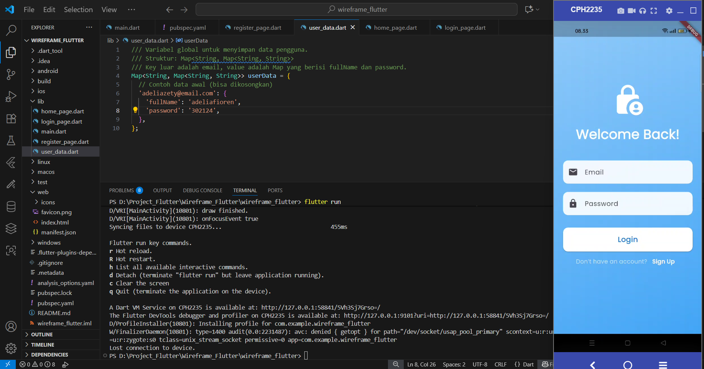

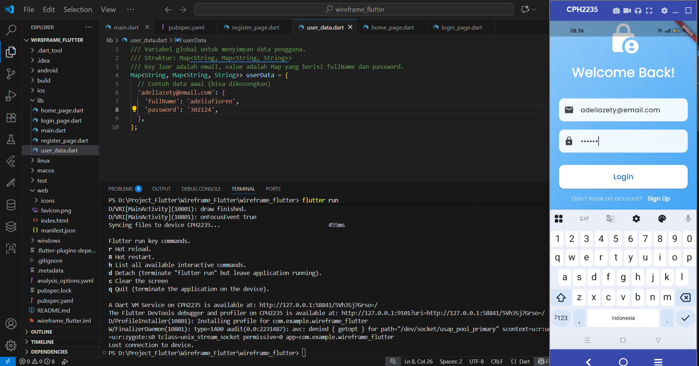

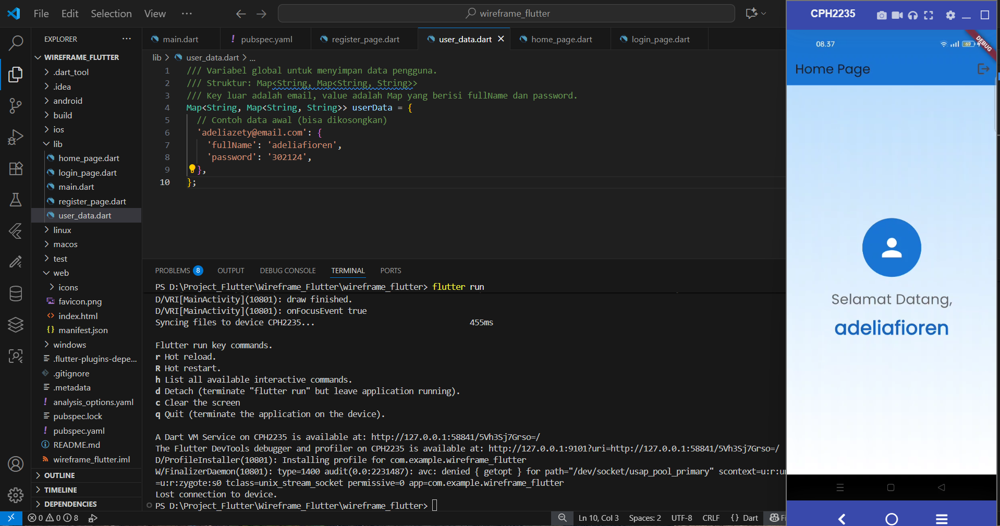

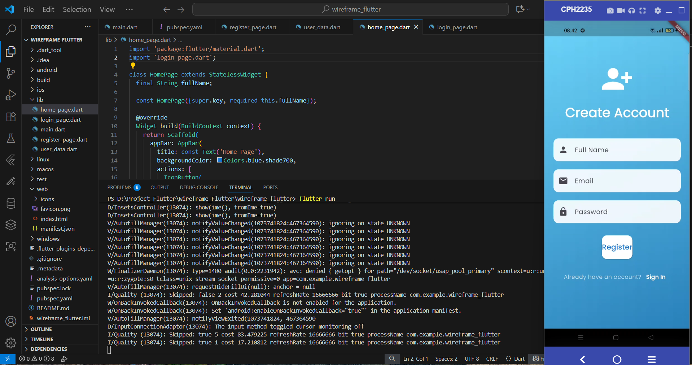

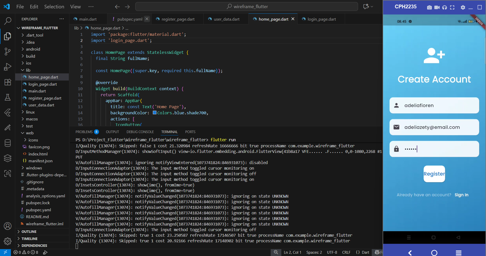

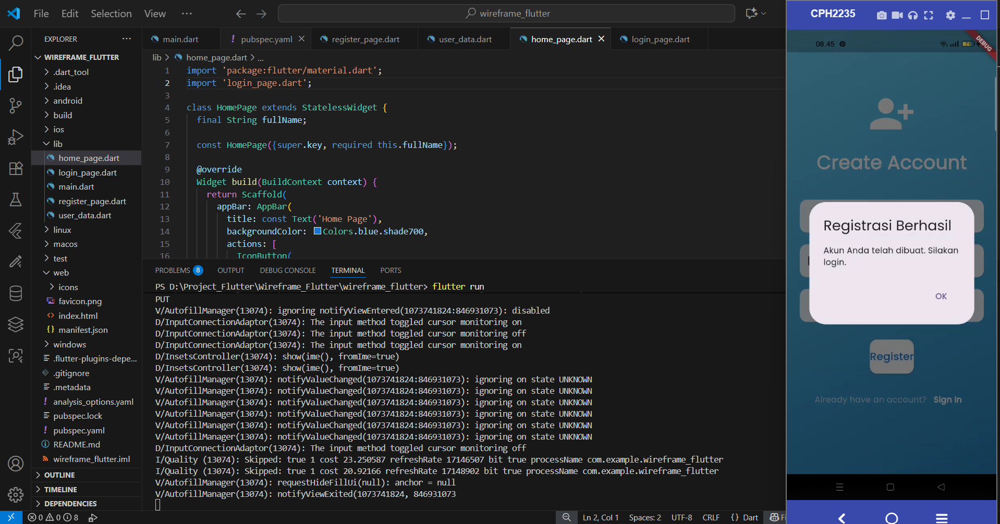

## Latihan untuk Eksplorasi Lebih Lanjut

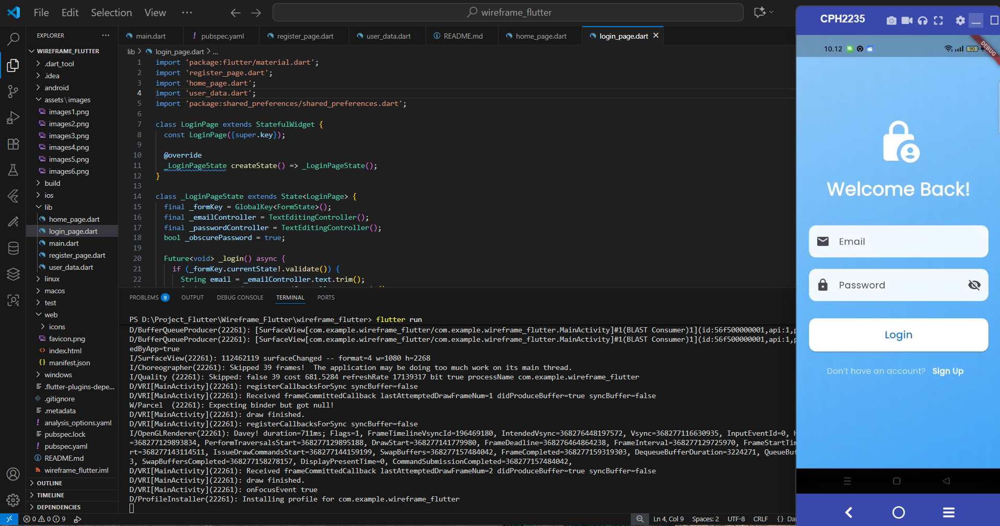

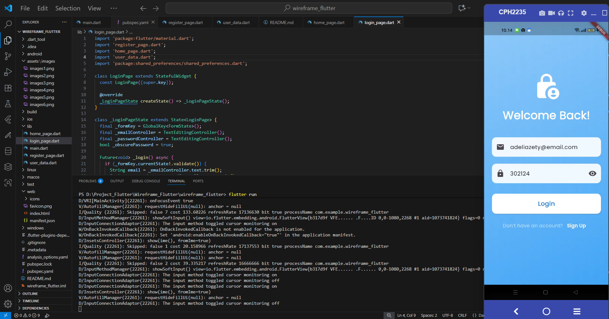

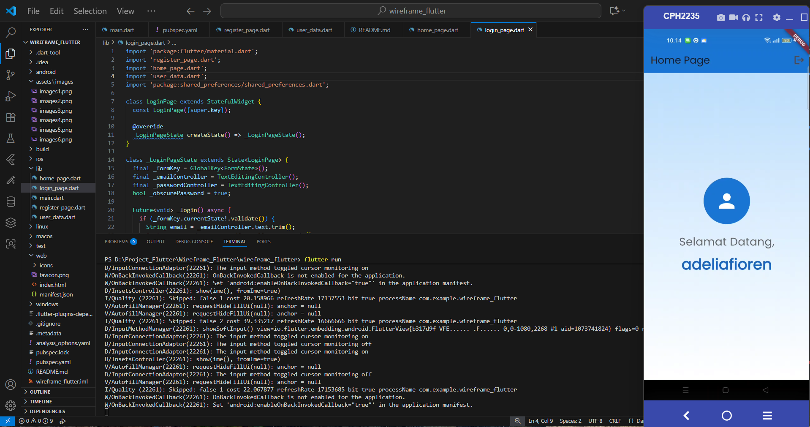

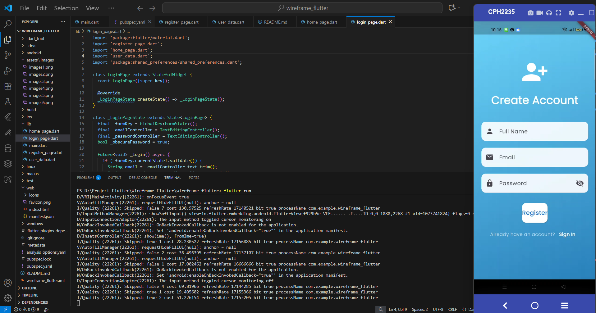

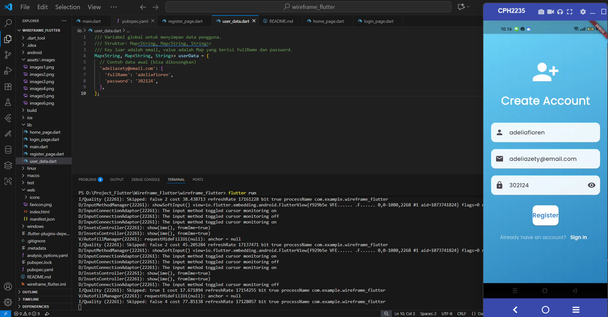

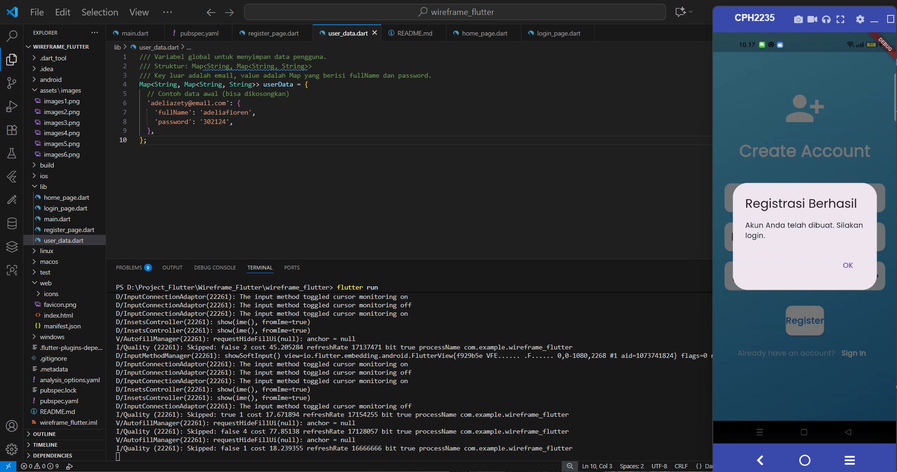

## Kesimpulan
    Wireframe memberikan fondasi yang kuat dalam pengembangan aplikasi, karena dengan merancang layout secara visual terlebih dahulu, mahasiswa dapat mengidentifikasi kebutuhan komponen UI, alur navigasi antar halaman, dan pengalaman pengguna secara keseluruhan, yang pada akhirnya mempermudah proses coding dan menghasilkan produk akhir yang lebih terstruktur dan fungsional.

